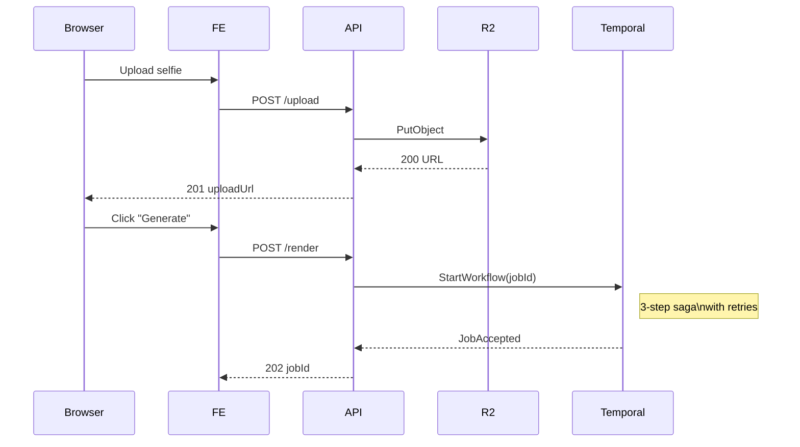
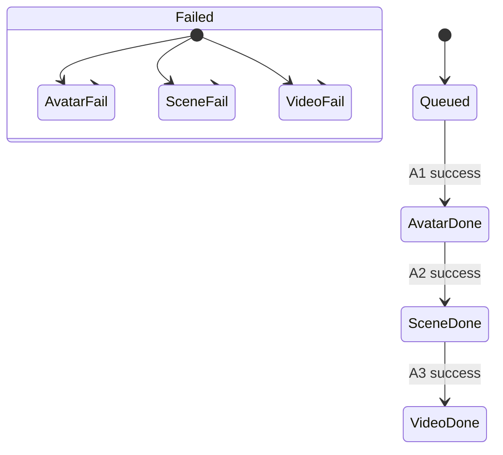

### Technical Solution Design (TSD)

ComicMotion v 1.0 – "Selfie-to-Animated Short"  
_Last updated: 02 May 2025_

---

#### 0 . Legend

🟦 = Managed in-house 🟩 = 3rd-party SaaS/API 🟥 = External user / browser

---

### 1. Document Control

| Item       | Value                                                        |
| ---------- | ------------------------------------------------------------ |
| Owner      | Lead Solutions Architect                                     |
| Reviewers  | Engineering, DevOps, Security, Product                       |
| Status     | Draft 🔄                                                     |
| Source PRD | "ComicMotion v 1.0 – Selfie-to-Animated Short" (02 May 2025) |

---

### 2. Executive Summary

This TSD translates the product requirements into an implementable technical blueprint. It embeds module-level Technical Design Specifications (TDS) that define contracts, flows, data models, and quality attributes.

---

### 3. Reference Architecture (C4 – Container Level)

```mermaid
flowchart LR
    subgraph Browser[🟥 Client (Web/PWA)]
        UPLOAD --HTTPS--> FE[🟦 Next.js UI]
    end

    FE --tRPC / REST--> API[🟦 BFF / API Gateway]
    API --gRPC/REST--> Orchestrator[🟦 Temporal Workers]
    API --JWT--> Clerk[🟩 Auth & User Mgmt]
    API --Webhook--> Stripe[🟩 Billing]

    Orchestrator -->|S3-signed URLs| R2[(🟦 Cloudflare R2)]
    Orchestrator -->|HTTP| ReplicateGPT[🟩 GPT-Image-1]
    Orchestrator --> ReplicateVideo[🟩 Minimax video-01-live]

    subgraph Observability
        API --> Grafana
        Orchestrator --> Sentry
    end

    R2 --> CDN[(🟩 Bunny CDN)]
    CDN --signed URL--> Browser
```

Key patterns applied:

1. **Back-End-for-Front-End (BFF)** – isolates front-end from domain logic.
2. **Saga / Process Manager** – Temporal orchestrates the 3-step render workflow with retries, compensation, and idempotency.
3. **Event-Driven Architecture** – finished renders emit `render.completed` events for email/webhook consumers.

---

### 4. Non-Functional Mapping

| PRD NFR             | TSD Fulfilment                                  |
| ------------------- | ----------------------------------------------- |
| p95 API < 300 ms    | Fastify + tRPC, edge caching                    |
| 97 % render success | Temporal retries (2×) + automatic credit refund |
| SOC 2 readiness     | SSO, encrypted secrets (Vault), audit logs      |
| WCAG 2.1 AA         | Color-contrast tokens, keyboard navigation      |

---

## 5. Embedded Technical Design Specifications (TDS)

> Each module section uses the template: **Responsibilities / Interfaces / Data Models / Sequence Diagram / Quality Attributes**

---

### 5.1 Frontend (Next.js + tRPC)

**Responsibilities**  
• Upload UI, theme picker, progress tracker, download page.  
• PWA installability.

**Interfaces**  
| Method | Path | Request | Response |
|--------|------|---------|----------|
| `POST` | `/api/upload` | Multipart selfie | `{uploadUrl}` |
| `POST` | `/api/render` | `{theme, duration, selfieUrl}` | `{jobId}` |
| `GET` | `/api/job/:id` | – | `{status, assets}` |

**Data Models (simplified TS types)**

```ts
type Theme = 'city' | 'fantasy' | 'neon';
type JobStatus =
  | 'queued'
  | 'avatar_done'
  | 'scene_done'
  | 'video_done'
  | 'failed';
interface JobProgress {
  id: string;
  userId: string;
  theme: Theme;
  status: JobStatus;
  assetUrls: Partial<{ avatar: string; scene: string; video: string }>;
}
```

**Sequence Diagram**



**Quality Attributes**  
• Uses **Atomic Design** for components.  
• React Query cache for polling efficiency.  
• Responsive ≥ 320 px; dark-mode supported.

---

### 5.2 API Gateway / BFF

**Responsibilities**  
• Authentication guard.  
• Input validation (Zod).  
• Rate-limiting (per-IP + per-API key).  
• Emits domain events to NATS (future proofing).

**Design Patterns**  
• Adapter pattern for external services.  
• **Command → Orchestrator** (Reliability pattern).

**Interfaces** – see Front-end section.

**Quality**  
• p95 < 50 ms (compute only).  
• Circuit-breaker around Replicate 3rd-party calls.

---

### 5.3 Temporal Orchestrator _(Core TDS)_

| Step | Activity       | Replicate Model Used    | Retries | Compensating Action         |
| ---- | -------------- | ----------------------- | ------- | --------------------------- |
| A1   | GenerateAvatar | `openai/gpt-image-1`    | 2       | Issue credit refund         |
| A2   | GenerateScene  | `openai/gpt-image-1`    | 2       | Rollback avatar (delete R2) |
| A3   | GenerateVideo  | `minimax/video-01-live` | 2       | Rollback scene              |

**State Diagram**



**Idempotency Strategy** – job UUID + activity attempt number stored in Redis.

**Quality**  
• At-least-once semantics; side-effects guarded by deduplication token.  
• Horizontal scaling via Kubernetes HPA.

---

### 5.4 External AI Service Adapters

| Adapter           | Service Endpoint Used    | Target Model(s)         | Timeout | Fallback |
| ----------------- | ------------------------ | ----------------------- | ------- | -------- |
| Replicate Adapter | REST POST `/predictions` | `openai/gpt-image-1`    | 60 s    | Retry ×2 |
|                   |                          | `minimax/video-01-live` | 180 s   | Retry ×2 |

**Security** – Keys stored in HashiCorp Vault, injected via short-lived env vars.

---

### 5.5 Storage & CDN

**Flow**

1. Pre-signed PUT issued to client for selfie.
2. Worker saves generated assets with deterministic key:  
   `assets/{userId}/{jobId}/{stage}.png|mp4`
3. Final assets replicated to Bunny CDN edge; expiry = 90 days (configurable).

**Data Lifecycle** – `DELETE /job/:id` will:  
• Remove R2 objects & CDN cache.  
• Delete DB rows (soft-delete first, hard-delete after 14 days).

---

### 5.6 Data Persistence (PostgreSQL Aurora)

```mermaid
erDiagram
    users ||--o{ jobs : "1-n"
    jobs  ||--o{ assets : "1-n"
    users {
      uuid id PK
      varchar email
      int credits
    }
    jobs {
      uuid id PK
      uuid user_id FK
      enum status
      varchar theme
      timestamptz started_at
      timestamptz finished_at
    }
    assets {
      uuid id PK
      uuid job_id FK
      enum stage /* avatar|scene|video */
      varchar url
    }
```

---

### 6. Design Patterns & Principles Applied

| Category                  | Implementation                                         |
| ------------------------- | ------------------------------------------------------ |
| SOLID                     | Service classes respect SRP; interfaces injected (DI)  |
| Hexagonal Architecture    | Core domain (Job, Credit) isolated from adapters       |
| 12-Factor App             | Env config, stateless workers, disposability           |
| CQRS-Lite                 | Read models (job status) separated from write commands |
| Strangler Fig (migration) | Legacy monolith risk eliminated – all new code         |

---

### 7. Security Architecture

1. **AuthN** – Clerk JWT; short-lived (15 min) access token, refresh token rolling.
2. **AuthZ** – Claims: `role`, `credits_remaining`.
3. **Transport** – All edges via TLS 1.3; HSTS.
4. **Secrets** – Vault → sidecar injector; no secrets in env.
5. **OWASP ASVS** – Level 2 target; automated ZAP scans in CI.

---

### 8. DevOps & CI/CD

| Stage         | Tool                        | Guardrails                   |
| ------------- | --------------------------- | ---------------------------- |
| Code          | GitHub + Renovate           | lint, type-check, unit tests |
| Build         | TurboRepo cache             | SBOM via Syft                |
| Test          | Playwright e2e              | 90 % pass gate               |
| Deploy        | GitHub Actions → ArgoCD     | Canary 10 % traffic          |
| Observability | Grafana Cloud, Sentry, Loki | SLO alerts (PagerDuty)       |

---

### 9. Scalability & Performance Model

- **Throughput** – 1 K concurrent renders = ~150 RPS to API + 1 K Temporal activities.
- **Bottleneck** – 3rd-party model latency. Mitigation: queue spikes, back-pressure.
- **Cost Projection** – $0.15 COGS per render @ current Replicate pricing, verified with load test batch of 500.

---

### 10. Risks & Mitigations

| Risk                          | Probability | Impact | Mitigation                                 |
| ----------------------------- | ----------- | ------ | ------------------------------------------ |
| Minimax API rate-limits       | Med         | High   | Adaptive concurrency, back-off             |
| Sudden Replicate price change | Med         | Med    | Pluggable adapter → switch to in-house GPU |
| Abuse (deep-fake)             | High        | High   | Pre- & Post-filters, human review queue    |

---

### 11. Open Questions (carry-over)

1. Cache hot themes? (needs cost/benefit calc)
2. Minimum selfie resolution threshold? (experiment)
3. EU → US data transfer impact? (legal review)

---

## 12. Acceptance Criteria for TSD Sign-off

1. Sequence diagrams reviewed by eng leads.
2. Security team approves threat model.
3. DevOps can provision baseline infra from Terraform plan without manual edits.
4. All critical paths have ≥ 80 % unit test coverage.

---

_This TSD will be baselined after cross-functional review and will govern engineering implementation for ComicMotion v 1.0._
